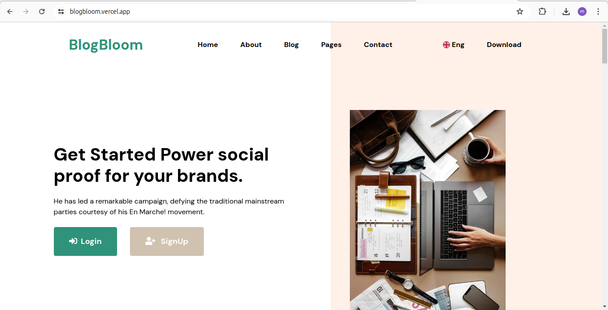

# about

# Skills

      

    &nbsp;&nbsp;&nbsp;&nbsp;&nbsp;&nbsp;&nbsp;&nbsp;&nbsp;&nbsp;&nbsp;&nbsp;&nbsp;&nbsp;&nbsp;&nbsp;&nbsp;&nbsp;&nbsp;&nbsp;&nbsp;&nbsp;  &nbsp;&nbsp;&nbsp;&nbsp;&nbsp;&nbsp;&nbsp;&nbsp;&nbsp;&nbsp;&nbsp;  

  

      

   

# Projects

 
 * **Blogging Site Using flask**
  

  

* **Source Code**     &nbsp;&nbsp;&nbsp;&nbsp;  **Open Source**
  <a href="https://github.com/mayankverma0097/BlogBloom"> **View** </a>

